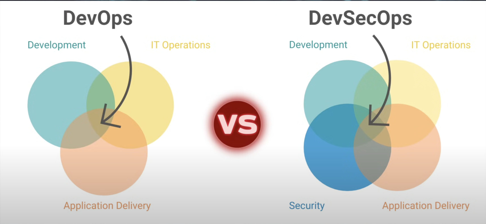
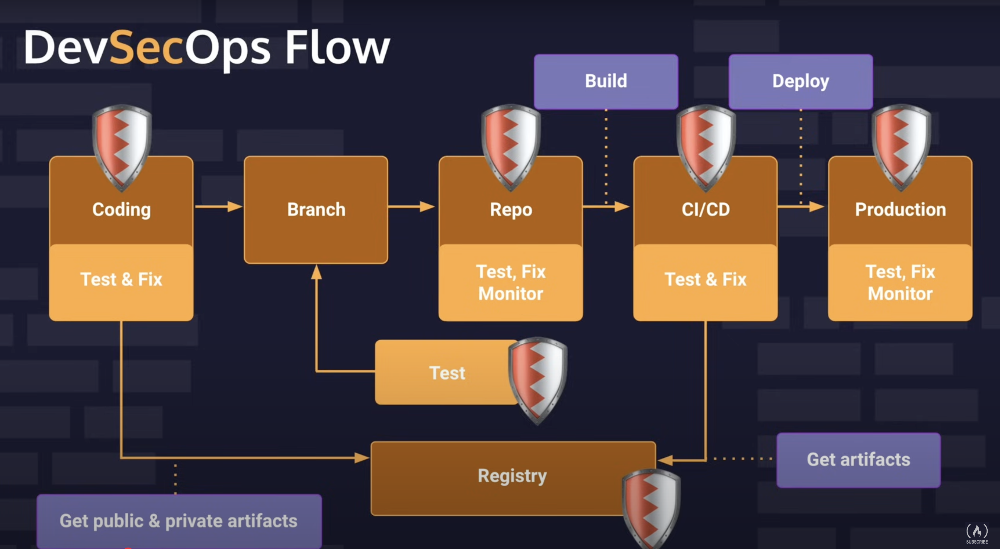

# DevSecOps

- Integration of security practices into DevOps software delivery model
- Security practices are integrated as early as possible into the software development

## 1. Vulnerabilities

- The average cost of a data breach was $3.86 Million in 2020

### Concepts

- Vulnerability: software code flaw, system misconfiguration that hackers can use to gain unauthorized access to a system or network
- Exploit: the method hackers use to exploit a vulnerability
- Threat: the actual/hypothetical exploit attempt on a vulnerability

### Types of vulnerabilities

- OWASP
- CWE
- Broken Access Control: hacker "hijacks" the system and gains control to portions of the application that it shouldn't have

1. Porous defenses

- One weakness that can be used to bypass or spoof authentication and authorization processes
  - Authentication: verifies identity
  - Authorization: verifies the level of access/permissions

2. Risky Resource Management
3. Insecure interaction between components

- Many applications today send and receive data across a wide range of services, threads, and processes
- The way they interact with each other can introduce vulnerabilities

## 2. DevOps vs. DevSecOps

- Set of practices that combine software development (dev) and IT operations (ops)
- Continuous delivery with high-software availability
- In DevSecOps, security is implemented on the different nodes of the CI/CD pipeline

- On an average software project, only 10-20% is custom code. We have, under the hood, thousands of libraries written
- Libraries and frameworks that you important can, themselves, import other libraries and frameworks
- Beyond libraries, we have containers, which are written with a bunch of packages inherited from public sources
