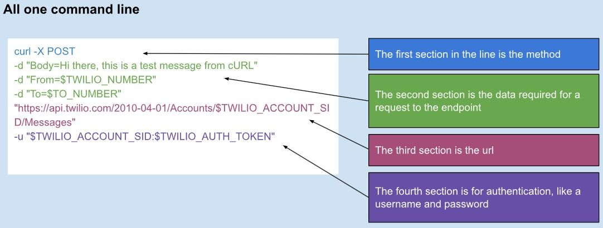

# DevSecOps

- Integration of security practices into DevOps software delivery model
- Security practices are integrated as early as possible into the software development

## 1. Vulnerabilities

- The average cost of a data breach was $3.86 Million in 2020

### Concepts

- Vulnerability: software code flaw, system misconfiguration that hackers can use to gain unauthorized access to a system or network
- Exploit: the method hackers use to exploit a vulnerability
- Threat: the actual/hypothetical exploit attempt on a vulnerability

### Types of vulnerabilities

- OWASP
- CWE
- Broken Access Control: hacker "hijacks" the system and gains control to portions of the application that it shouldn't have

1. Porous defenses

- One weakness that can be used to bypass or spoof authentication and authorization processes
  - Authentication: verifies identity
  - Authorization: verifies the level of access/permissions

2. Risky Resource Management
3. Insecure interaction between components

- Many applications today send and receive data across a wide range of services, threads, and processes
- The way they interact with each other can introduce vulnerabilities

## 2. DevOps vs. DevSecOps


- Set of practices that combine software development (dev) and IT operations (ops)
- Continuous delivery with high-software availability
- In DevSecOps, security is implemented on the different nodes of the CI/CD pipeline


- On an average software project, only 10-20% is custom code. We have, under the hood, thousands of libraries written
- Libraries and frameworks that you important can, themselves, import other libraries and frameworks
- Beyond libraries, we have containers, which are written with a bunch of packages inherited from public sources

## 3. Exploiting common vulnerabilities

### Intercepting HTTP Request and Injecting SQL

1. Download Burp Suite: https://portswigger.net/burp/releases/professional-community-2025-4-4
2. Spin up the browser inside Burp Suite
3. Intercept HTTP requests
4. Modify the request:

```json
// change to json -> we will inject SQL here
Content-Type: application/json
Accept: application/json, */*;q=0.5

// injecting sql
{
"username":"admin@snyk.io",
	"password": {"$gt": ""}
 }
```

5. Then forward the request

### Using CURL

- CURL: Command-line utility for transferring data to or from a server
  

#### CURL Structure

1. curl -X POST -> method
2. Data required for endpoint

```
-d "Body=hey"
-d "From=somewhere"
-d "To=someone"
```

3. `https://cool_website/endpoint/` -> the url

4. authentication

```
-u "$SOME_AUTH"
```

- Logging and getting the credentials

- curl X "POST" -> uses the HTTP post
- --cokie c.txt -> reads any existing cookies from the file c.txt and includes them in the request
- --cookie-jar c.txt -> after the response, saved any "Set-Cookie" headers back into c.txt (subsequent requests reuse the session)
- -H "Content-Type: application/json" -> sets the header of content type, telling the server to expect JSON in the body
- --data-binary -> sends the JSON payload as-is (no URL-encoding)
- "http/..." -> the endpoint

```bash
curl -X "POST" --cookie c.txt --cookie-jar c.txt -H 'Content-Type: application/json' --data-binary '{"username":"admin@snyk.io", "password":"SuperSecretPassword"}' 'http://localhost:3001/login'
```

- Retrieving data from server

```bash
curl -X "POST" --cookie c.txt --cookie-jar c.txt -H 'Content-Type: application/json' --data-binary '{"email":"admin@snyk.io", "firstname": "admin", "lastname":"admin", "country":"IL", "phone":"+123123", "layout":"../../package.json"}' "http://localhost:3001/account_details"
```

### Injecting JavaScript

```
localhost:3001/login?redirectPage="><script>alert("hey")</script>
```

### How to prevent the most common cross site scripting attack

```
<!-- this is injects javascript into the html -->


```

- How to solve it?

```js
// instead of using innerHTML, use innerText
document.getElementById("query-output").innerHTML = query;

// instead of using innerText, use innerText
document.getElementById("query-output").innerText = query;
```

## 4. Solving Vulnerabilities

- Search for `Snyk` extension on VSCode store
- Install it and grant it permission and the necessary credentials

### Installing snyk

```
npm install -g snyk
snyk auth
```

- We can also setup Snyk to run on the CI/CD pipeline to check out the code security

### SAST (Static Application Security Testing)

- It's a security testing that analyzes an application's source code, bytcode, or compiled code to identify potential vulnerabilities before it's deployed or executed

- SAST tools analyze code patterns, data flows, and control flows within the application to detect various security risks, such as SQL injection, cross-site scripting, and buffer overflows

#### SAST vs DAST

- SAST differs from DAST (Dynamic Application Testing), which analyzes the application from an external perspective by simulating attacks
- SAST focuses on the code itself, while DAST on the application's behavior when it's running

## 5. DevSecOps and Containers

- Development and Operations
- Fast, repeatable builds
- Ideation to production
- Security, for a while, would be a late-stage thing
- As containers became more of a thing, security started "moving-left" on the CI/CD pipeline
- Dev Sec Ops -> Between development and operations, there should be security

### SDLC (Software Development Life Cycle) Pipeline

- Structured process for building and delivering software
- It automates and integrates various stages: coding, testing, deployment
- Faster and more reliable software releases by automating tasks and providing continuous feedback
- Chain of automated processes that move code through different stages

1. Requirements gathering
2. Design
3. Development | coding
4. Testing
5. Deployment
6. Maintenance

### Containers Challenges

1. Increased scope of responsibility

- historically, developers took care of their code and the libraries used
- however, with containers, we add security concerns at the OS level: base-image selection, package installation, user and file permissions, etc

2. Lack of expertise

- these technologies used to be owned by other teams (system engineers, middleware teams)
- many developers have never had to deal with securing these layers of the stack

3. Maintaining velocity

- while shifting security left adds responsibilites to dev teams, the business owners have expectations that pipeline velocity won't be negatively impacted

### Securing containers

- Hackers might look into some server technologies and check which "fixes" they've done to some versions. Then, they can exploit these, knowing that in case some services are running on the previous (non-fixed versions), they can exploit those

One interesting website: https://www.exploit-db.com/

- These vulnerabilities include the possibility of sending files to somebody else's server or grab files from it

- We can use Snyk, or other container scanning, to identify vulnerabilities on the docker image. Then, it returns similar to an ESLint error when we try to build the code. By doing that, ultimately, we're able to identify vulnerabilities and address them, either by changing the way the image is built or updating the library

### Defense in Depth

- Let's cover this into three themes: images, runtime, k8s

#### Images

- Minimize footprint: don't give hackers more tools to expand their exploits
- Layer housekeeping: understand how layers work at build and run-time
- Build strategies: multi-stage, repeatable builds, standardized labeling, alternative tools
- Secure supply chain: know where images come from. Only CI should push to registries

#### Runtime

- Don't run as root: you probably don't need it
- Privileged containers: almost definitely don't need it
- Drop capabilities: Most apps don't need even Linux capabilities; dropping all and allow only what's needed
- Read only root filesystem: Immutability makes exploiting your container harder
- Deploy from known sources: pull from known registries only

#### Kubernetes

- Secrets: Make sure they are encrypted
- RBAC: Role-based access control
- SecurityContext
- Network policy: start with zero-trust and add rules as needed
- Enforcement
